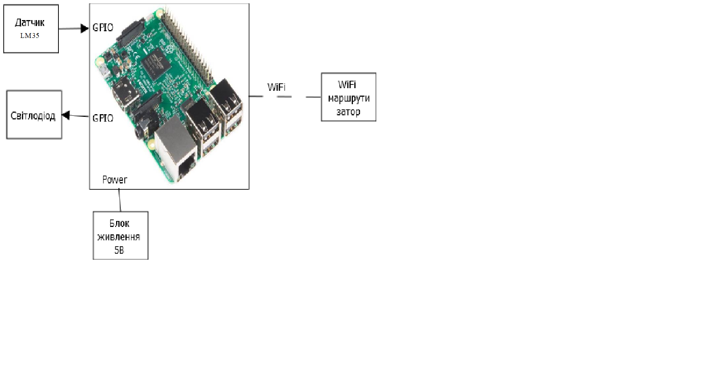

# Тема. Дистанційний контроль температури людей в приміщенні.

## Розділ 1. Розробка вимог до системи та ПЗ.

### Загальний опис проектованої системи.

Система повинна забезпечувати дистанційне сканування температури людей в приміщенні з веденням журналу та формування повідомлень.     

### Вимоги до функцій та задач.

Система повинна передбачати виконання наступних функцій:

1. неперервне вимірювання температури людей (в градусах Цельсія) з періодичністю не більше ніж 1 секунда
2. індикація температури через інтенсивність світіння світлодіоду
3. відображення плинного значення температури об'єкту на локальному WEB-інтерфейсі та віддалено за допомогою Телеграм-бота та мобільного застосунку:
   - на локальному WEB-інтерфейсі та мобільному застосунку періодично, 1 раз/сек у вигляді кругової діаграми і числового значення в сантиметрах;
   - у Телеграм-боті передбачити режими: відображення по запиту плинного значення; включення/відключення періодичного оповіщення 1 раз/5 секунд за командою;
4. архівування значень температури об'єкту в локальну базу даних середнє за останні 10 секунд
5. відображення температури об'єкту у вигляді графіку за останні 60 секунд на:
   - локальному ВЕБ-інтерфейсі
   - мобільному застосунку
   - Google Worksheet
6. оповіщення через Телеграм-бот та пошту, якщо температура менше заданої уставки
7. формування звітів на Веб-сайті раз/годину або за запитом з відображенням:
   - у табличному та графічному вигляді відстань за останню годину
   - показники мінімальної/максимальної та середньої температури об'єкту  

### Вимоги до видів забезпечення. 

#### Вимого до апаратного забезпечення 

Необхідно використання наступних засобів: 

- Raspberry PI3 (або RPI4), або аналогічний
- датчики температури від -50 °С до +330 °С
- наявне підключення RPI до мережі Internet через мережу WiFi або Ethernet
- смартфон або планшет з Android > V5
- прототип буде знаходитися у кімнатних умовах 

#### Програмні засоби та Інтернет-сервіси

Необхідне використання наступних програмних засобів:

- Node-RED як база для розробки ПЗ + dashboard для локального веб-інтерфейсу
- система керування базами даних, розгорнута на  RPI (MariaDB)
- хмарний застосунок Google Sheets для аналітики  
- веб-сайт для онлайн доступу для звітів на базі Google Sites
- Telegram-бот для віддаленого контролю та керування 
- `IoT MQTT Panel` для віддаленого контролю та керування 

## Розділ 2. Розробка архітектури та необхідної проектної документації.

### Технічна структура системи .

Технічна структура системи показана на рисунку.

рис.1

### Принципові схеми та схеми підключення. 

Принципова схема підключення датчиків та виконавчих механізмів до RPI3 показана на рисунку. 

рис.2

Монтажна схема підключення плати з прототипом показана на рисунку.

рис.3

### Відомість апаратних та програмних засобів.

Таб.1

| Найменування                               | Кількість | Примітка                                                  |
| --------------------------------------     | --------- | --------------------------------------------------------- |
| Raspberry PI                               | 1         | У комплекті з корпусом, блоком живлення та картою пам'яті |
| Макетна плата 170                          | 1         |                                                           |
| LM35 Temperature Sensor                    | 1         |                                                           |
| Світлодіод                                 | 1         |                                                           |
| Резистор 1 кОм                             | 1         |                                                           |
| Провід dupont (мама-тато)                  | 5         | 2 білі, зелений, оранжевий і сірий                        |

### Програмна структура системи.

Програмне забезпечення включає наступні частини:

#### ПЗ Raspberry PI

- операційна система: Raspbian
- VNC Server
- СКБД MariaDB
- середовище Node.JS
- середовище Node-RED
- модулі Node-RED: ...
-   

#### Хмарні застосунки та сервіси

- Google Sites
- Telegram
- Google Sheet

#### ПЗ для Android

- `IoT MQTT Panel`
- будь-який браузер
- Телеграм-клієнт

## Розділ 3. Методика перевірки та засобів тестування.

### Методика перевірки підсистеми Edge-рівня.

Методика перевірки Edge-рівня передбачає окрему перевірку функцій:

- функцій вводу/виводу
- функцій відображення та керування на локальному Веб-інтерфейсі
- функцій архівування в локальну базу даних
- функцій взаємодії з зовнішніми сервісами за застосунками

Перевірка функцій архівування описана в наступному підрозділі. Перевірка функцій взаємодії з зовнішніми сервісами за застосунками проводиться разом з перевіркою відповідних функцій. 

#### Перевірка функцій вводу виводу

- використовуючи вивід в налагоджувач перевіряється, що при зміні положення об'єкту у вікні Node-RED відображається коректні значення з періодичністю 1 секунда
- використовуючи вузол `inject` задаючи необхідну потужність перевіряється чи змінюється інтенсивність світіння індикаторного світлодіоду

#### Перевірка функцій відображення та керування на локальному Веб-інтерфейсі

- використовуючи вузол `inject` задаючи необхідне значення відстані, воно повинно відображатися у полі 
- повинна бути передбачена окрема закладка у локальному Веб-інтерфейсі для налагодження:
  - перемикач імітація/реальний об'єкт для можливості вибору джерела даних (з датчиків або імітоване)
  - повзунками для імітації значення наближення, або задаванням значення в полі, необхідно задати імітоване значення, яке повинно відобразитися на полі відображення відстані
- при зміні значення уставки мінімального значення наближення нижче дійсного повинно з'явитися повідомлення "Об'єкт надто близько!", при поверненні в норму, напис повинен щезнути
- імітуючи зміну значення наближення проконтролювати що графік (тренд реального часу)  правильно показує цю зміну     

### Методика перевірки функцій архівування.

функцій збереження даних в базу даних

### Методика перевірки аналітичних сервісів.

### Методика перевірки діалогових сервісів. 

## Розділ 4. Розробка та налагодження програмного забезпечення та супровідної документації.

### ПЗ для Edge-рівня.

ПЗ розроблено в середовищі Node-RED, яке запускається автоматично з запуском Raspberry PI.

Застосунок включає кілька потоків (`Flow`):

- `IO` для обробки значень входів та керування виходами
- `process` для обробки і імітації змінних 
- `History` для роботи з локальною базою даних для збереження даних 
- `Alarm` для роботи з тривогами
- `UI` для роботи з локальним ВЕБ-інтерфейсом 
- `Bot` для роботи з чат-ботом Telegram
- `Report` для формування звітів та взаємодії з `Google Sheet`

Система передбачає взаємодію через глобальні контексти Noe-RED. Передбачено наступні глобальні контексти:

- `RTDB` - для збереження конфігураційних та плинних даних вимірювання та керування та трендів на останню хвилину
- `ALM` - для збереження конфігураційних даних для налаштування тривог та стану тривог
- `RPRT` - для збереження буферу для формування звітів

### Схеми інформаційної взаємодії 

### ПЗ для хмарних рішень

- Налаштування Google Sheet
- Налаштування Telegram

### WEB-інтерфейси (локальний для Edge та глобальний)

- зовнішній вигляд локального WEB-інтерфейсу
- опис потоку `UI`  
- зовнішній вигляд та опис інтерфейсу глобального Веб-інтерфейсу

### Датчик температури LM35
Серія LM35 це прецизійні інтегральні датчики температури, у яких вихідна напруга пропорційно температурі за шкалою Цельсія. Це одна з переваг над датчиками з вихідною напругою за шкалою Кельвіна. Не потрібно вичитати високостабільного напруга з вихідної напруги для перекладу в шкалу за Цельсієм.
LM35 забезпечує вимір температури з точністю ± 0.25 ° C в кімнатних умовах і з точністю ± 0.75 ° C в повному діапазоні робочих температур -55 ... +150 ° C, без зовнішньої калібрування або підгонки вихідної напруги.

### Підключення
Датчик TMP35 має три висновки (три ноги). Якщо подивитися на датчик з боку цих висновків і зрізом вгору, як показано на малюнку, то зліва буде - позитивний контакт харчування (+2.7 - 5.5В), по центру - вихід на контролер, і справа - негативний контакт живлення (земля).
Датчик аналоговий, а значить на його виході ми маємо не 0 або 1, а напруга в діапазоні від 0 до 5 вольт.

### Особливості датчика
Низька вартість, гарантована точність 0,5С, широкий діапазон напруг (від 4 до 30В), струм менш 60мА, малий рівень власного розігріву (до 0,1), вихідний опір 0,1 Ом при струмі 1 мА.

### Рекомендації щодо застосування.

Корпуси датчиків повинні бути приклеєні або притиснуті до контрольованої поверхні. Тоді температура датчиків буде в межах 0.01 ° C від температури поверхні.
Передбачається, що температура навколишнього повітря дорівнює температурі поверхні. В іншому випадку фактична температура датчика LM35 буде середньою між температурами поверхні і повітря. Особливо, це має значення для пластикових корпусів TO-92, в яких мідні висновки відводять значну кількість тепла. В цьому випадку реальна температура датчика може бути навіть ближче до температури навколишнього повітря, а не до температури поверхні. Щоб мінімізувати цю проблему, намагайтеся проводити висновки підключення датчиків так, щоб їх температура дорівнювала температурі поверхні, на якій встановлений датчик. Один із способів - покрити ділянку поверхні з висновками LM35 компаундом. Це вирівняє температуру висновків датчика і поверхні, і зменшить вплив навколишнього повітря.

